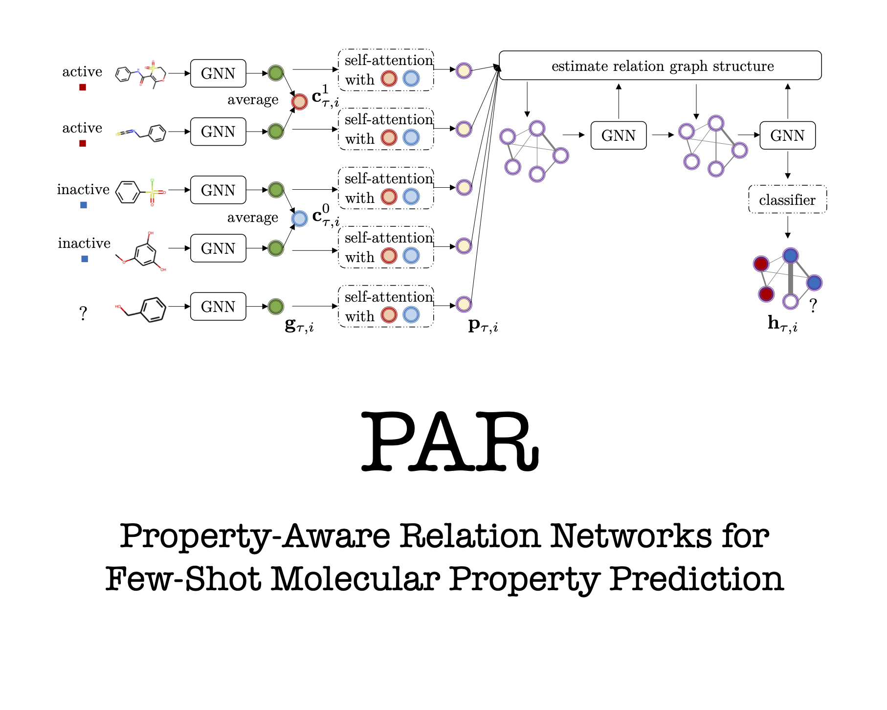

This is the PyTorch implementation of ["Property-Aware Relation Networks (PAR) for Few-Shot Molecular Property Prediction (spotlight)"](https://papers.nips.cc/paper/2021/hash/91bc333f6967019ac47b49ca0f2fa757-Abstract.html) published in NeurIPS 2021 as a spotlight paper. 
We will also release a PaddlePaddle implementation soon. 

<p align="center">

Please cite our paper if you find it helpful. Thanks. 
```
@InProceedings{wang2021property,
  title={Property-Aware Relation Networks for Few-Shot Molecular Property Prediction},
  author={Wang, Yaqing and Abuduweili, Abulikemu and Yao, Quanming and Dou, Dejing},
  booktitle = {Advances in Neural Information Processing Systems},
  year={2021},
}
```

## Environment  
We used the following Python packages for core development. We tested on `Python 3.7`.
```
- pytorch 1.7.0
- torch-geometric 1.7.0
```

## Datasets 
All the necessary data files can be download from [chem data](http://snap.stanford.edu/gnn-pretrain/data/chem_dataset.zip) (2.5GB), unzip it.
We provide the tox21 dataset as demo in [data](data)

## Experiments
To run the experiments, use the command (please check and tune the hyper-parameters in [parser.py](parser.py):
```
python main.py
```

If you want to quickly run PAR method on tox21 dataset, please use the command:
```
bash script_train.sh
```